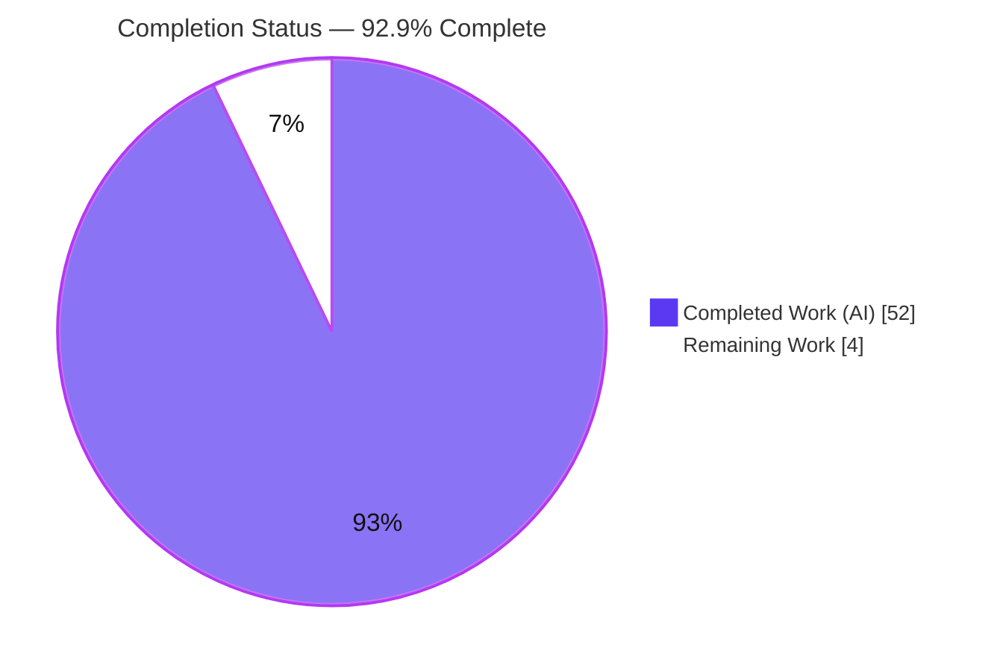
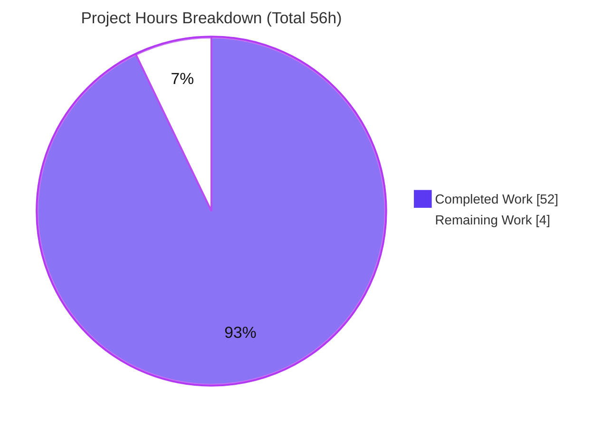
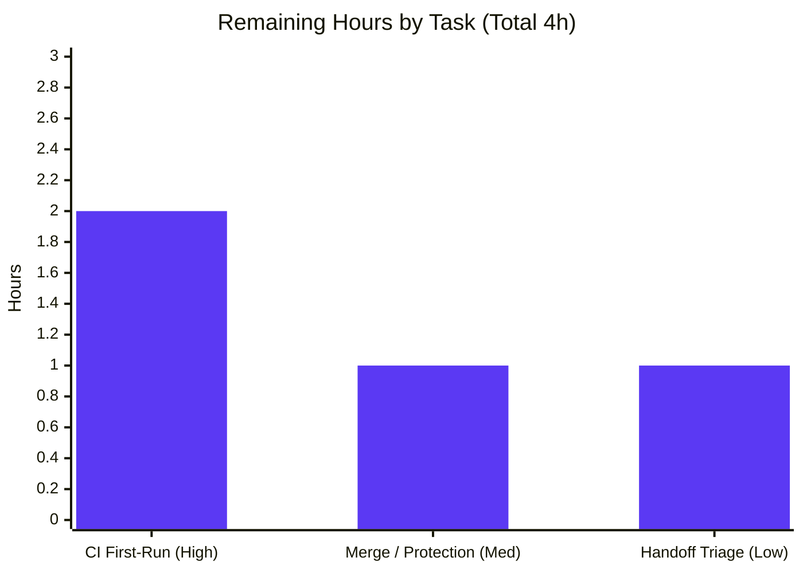

# Blitzy Project Guide — MAVLink In-Repo Test Suite

---

## 1. Executive Summary

### 1.1 Project Overview

This project introduces a focused, self-contained test suite into the `blitzy-public-samples/mavlink` repository — a header-only C message-marshalling library whose C headers are generated from XML message definitions by the Python `pymavlink`/`mavgen` tooling. The repository previously shipped **no in-repo tests** (all prior coverage lived in the vendored `pymavlink` submodule). The suite validates the critical path **XML → generated header → compile → pack/unpack round-trip** for MAVLink 2 across three layers: (1) Python validation of all 19 dialect definitions, (2) a Python generation-and-compile integration test for `common.xml`, and (3) a C runtime round-trip test for ten representative messages plus one corrupted-CRC rejection. Target users are MAVLink maintainers and contributors who need fast regression protection for definitions and the generated wire API.

### 1.2 Completion Status

The project is **92.9% complete** on an AAP-scoped, hours-based basis. Every deliverable defined in the Agent Action Plan is implemented, compiles, and passes; the remaining 4 hours are human-only path-to-production activities (first CI run on GitHub-hosted runners, merge/branch-protection, and handoff-note triage).



| Metric | Value |
|--------|-------|
| **Total Hours** | 56 |
| **Completed Hours (AI + Manual)** | 52 (52 AI + 0 Manual) |
| **Remaining Hours** | 4 |
| **Percent Complete** | **92.9%** |

### 1.3 Key Accomplishments

- ✅ **XML definition validation layer** — parametrized `pytest` module validating all **19** dialects (well-formedness, message-ID range `[0, 16777215]`, per-file ID uniqueness, field-type legality) → **57 tests passing**.
- ✅ **Generation-pipeline integration test** — invokes `mavgen --lang=C --wire-protocol=2.0` for `common.xml` into a temp directory, asserts headers exist, and compiles a translation unit under `gcc -Wall` → **2 tests passing**.
- ✅ **C runtime round-trip test** — pack → serialize → parse → decode for all **10** representative messages (typical + min/max integer/float edges + max-length STATUSTEXT) plus one corrupted-CRC rejection → **1 CTest passing** ("ALL ROUND-TRIP TESTS PASSED").
- ✅ **Opt-in build gating** — root `CMakeLists.txt` gains `option(MAVLINK_BUILD_TESTS ... OFF)` + a guarded `add_subdirectory(tests)` (a **7-line** change); default builds are byte-for-byte unchanged.
- ✅ **CI workflow** — new `.github/workflows/tests.yml` runs the Python and C layers on `ubuntu-latest` for push and pull_request.
- ✅ **Documentation** — `tests/README.md` documents local execution, single-test, and debugging.
- ✅ **Discipline verified** — exactly **9 files / 795 insertions / 0 deletions**; `pymavlink` submodule intact at pin `aa033552` (v2.4.49); full suite runs in **~8 seconds** (well under the 5-minute budget).

### 1.4 Critical Unresolved Issues

| Issue | Impact | Owner | ETA |
|-------|--------|-------|-----|
| *(none)* — 60/60 tests pass with zero unresolved errors | No release-blocking or validation-blocking issues identified | — | — |

There are **no critical unresolved issues**. All four items surfaced during validation are benign, non-blocking, and out-of-scope to fix (see §5 and §6); they are documented for handoff only.

### 1.5 Access Issues

| System/Resource | Type of Access | Issue Description | Resolution Status | Owner |
|-----------------|----------------|-------------------|-------------------|-------|
| *(none)* | — | No access issues identified | N/A | — |

**No access issues identified.** The project requires no external service credentials, API keys, or secrets. All inputs (dialect XML, `pymavlink` submodule) are in-repo; the C toolchain is runner-provided. GitHub Actions execution requires only standard repository push permissions.

### 1.6 Recommended Next Steps

1. **[High]** Push the branch and confirm the new **Tests** workflow runs green on GitHub-hosted `ubuntu-latest` (first real CI execution).
2. **[Medium]** After CI is green, merge to `main`; optionally add the **Tests** workflow as a required status check for future PRs.
3. **[Low]** Triage the four documented handoff notes (dormant `BUILD_TEST` guard, CMake version-deprecation warning, `mavgen` `MAV_BOOL_FALSE` notice, generated-header packed-member warnings) and decide whether to file follow-up issues.

---

## 2. Project Hours Breakdown

### 2.1 Completed Work Detail

| Component | Hours | Description |
|-----------|-------|-------------|
| XML definition validation layer | 6 | `tests/python/test_xml_definitions.py` — 3 parametrized checks × 19 dialects (57 tests): well-formedness, 24-bit ID range, per-file ID uniqueness, field-type legality (incl. `[N]` arrays + `uint8_t_mavlink_version`) |
| Generation-pipeline verification layer | 6 | `tests/python/conftest.py` (session-scoped `generated_common_headers` fixture running `mavgen`) + `tests/python/test_generate_common.py` (headers-exist + `gcc -Wall` compile) |
| C round-trip runtime test | 14 | `tests/c/test_roundtrip.c` — 10 messages × 3 edge sets, field-by-field decode asserts, caller-owned parse-buffer loopback isolation, corrupted-CRC negative test |
| C test CMake build script | 5 | `tests/c/CMakeLists.txt` — generate MAVLink 2 headers into the binary dir, build with upstream flags, register `roundtrip` with CTest |
| Build gating (root CMake + aggregator) | 2 | Root `CMakeLists.txt` `option(MAVLINK_BUILD_TESTS OFF)` + guarded `add_subdirectory(tests)`; `tests/CMakeLists.txt` aggregator |
| CI workflow | 3 | `.github/workflows/tests.yml` — push + pull_request, `ubuntu-latest`, recursive submodule checkout, pinned deps, `pytest` + CMake + CTest |
| Documentation | 2 | `tests/README.md` — prerequisites, run/single/debug commands, isolation notes |
| Research & discovery | 6 | Version verification (`pytest`/`lxml`), `mavgen` entry point, MAVLink 2 CRC/framing facts, 19-dialect enumeration, 10 message-ID/field verification |
| Review-fix iteration | 4 | 7 agent commits incl. review-finding resolution, authoritative `PYTHONPATH`, spec-aligned option naming, aggregator finalization |
| Autonomous validation & integrity | 4 | Dependency checks, clean compilation, 60-test execution, runtime verification, scope/submodule-integrity checks, handoff-note documentation |
| **Total** | **52** | **Matches Completed Hours in §1.2** |

### 2.2 Remaining Work Detail

| Category | Hours | Priority |
|----------|-------|----------|
| CI first-run verification on GitHub hosted runners | 2 | High |
| Merge to `main` + branch-protection / required-status-check decision | 1 | Medium |
| Handoff-note triage (4 documented notes; decision only, no fixes) | 1 | Low |
| **Total** | **4** | **Matches Remaining Hours in §1.2 and §7** |

**Basis of estimate.** Estimates use the PA2 engineering-hours framework anchored to the AAP scope. The suite is **795 net insertions across 9 files** in a specialized wire-protocol domain (MAVLink 2 framing, CRC-16/MCRF4XX, `CRC_EXTRA`, code-generation pipeline), which required documented upfront research and multiple review-fix iterations. Completed effort (~15 LOC/hour including research, design, iteration, and validation) is consistent with careful, fully-tested, documented greenfield test code. Remaining effort is a small human-only path-to-production tail: the CI workflow has never executed on GitHub's hosted runners, merge is a human gatekeeping action, and the handoff notes require a human decision. **Confidence: High** for completed work (independently re-verified); **High** for remaining work (well-defined, low-effort verification and decision tasks).

---

## 3. Test Results

All tests below originate from Blitzy's autonomous validation logs and were **independently re-executed** during this assessment on the destination branch (venv Python 3.13.7, `PYTHONPATH=<repo root>`).

| Test Category | Framework | Total Tests | Passed | Failed | Coverage % | Notes |
|---------------|-----------|-------------|--------|--------|------------|-------|
| XML Definition Validation (Unit) | pytest 9.1.1 | 57 | 57 | 0 | N/A | 19 dialects × 3 checks (well-formed, ID range/uniqueness, field types) |
| Generation & Compile (Integration) | pytest 9.1.1 | 2 | 2 | 0 | N/A | `mavgen` generate + `gcc -Wall` compile of `common.xml` headers |
| C Runtime Round-trip (Unit/E2E) | CTest 3.31.6 | 1 | 1 | 0 | N/A | 1 registered test running 10 messages × 3 edges + corrupted-CRC rejection |
| **TOTAL** | — | **60** | **60** | **0** | **N/A** | **100% pass rate** |

**Coverage %** is intentionally **N/A**: per the AAP there is no numeric coverage gate and no coverage tooling (`pytest-cov`/`coverage.py`) is introduced. Success is defined by **functional completeness** — all dialects validate, `common.xml` generates and compiles, all ten messages round-trip with field equality, and the corrupted frame is rejected.

**Execution evidence:** `pytest` → `59 passed in 0.61s`; `cmake --build` → `[100%] Built target test_roundtrip` (zero warnings/errors); `ctest` → `100% tests passed, 0 tests failed out of 1`. Full CI-equivalent sequence completes in **~8 seconds**.

---

## 4. Runtime Validation & UI Verification

**Runtime health** (headless library + test suite; validated by direct execution):

- ✅ **Operational** — `mavgen --lang=C --wire-protocol=2.0` generates `common.xml` MAVLink 2 headers (`common/mavlink.h`, `common/common.h`, `mavlink_types.h`, `checksum.h`, `mavlink_helpers.h`); exit 0.
- ✅ **Operational** — C `test_roundtrip` executable runs standalone and prints `ALL ROUND-TRIP TESTS PASSED`; exit 0.
- ✅ **Operational** — Python test runtime: `pytest tests/python` → 59 passed.
- ✅ **Operational** — CTest runtime: `ctest --test-dir build` → 1/1 `roundtrip` passed.
- ✅ **Operational** — Isolation contract: generated headers land only in the CMake binary directory; the source tree is never written to.

**UI verification:** ⚠ **Not applicable** — this project is a header-only C marshalling library plus a test suite. There is no user interface, front end, or rendered surface to verify.

**API integration:** ⚠ **Not applicable** — the suite performs no network, database, or external-service calls. The only "integration" is the local `mavgen` → `gcc` generation-and-compile pipeline, which is ✅ **Operational**.

---

## 5. Compliance & Quality Review

Cross-mapping of AAP deliverables and constraints to their validated status. Fixes applied during autonomous validation: **none required** (the committed suite passed as-is).

| Benchmark / Deliverable | Requirement (AAP) | Status | Progress |
|-------------------------|-------------------|--------|----------|
| XML validation (Target 1) | Validate all 19 dialects | ✅ Pass | 100% |
| Generation + compile (Target 2) | `common.xml` generates & compiles clean | ✅ Pass | 100% |
| C runtime round-trip (Target 3) | 10 messages round-trip + CRC rejection | ✅ Pass | 100% |
| Build gating | `option(MAVLINK_BUILD_TESTS OFF)` + guarded include | ✅ Pass | 100% |
| CI workflow authored | push + PR on `ubuntu-latest` | ✅ Pass | 100% |
| Documentation | `tests/README.md` local run guide | ✅ Pass | 100% |
| Minimal change principle | Only 9 permitted files touched | ✅ Pass | 100% |
| No production/XML/generated edits | Source & definitions unchanged | ✅ Pass | 100% |
| Submodule pin untouched | `pymavlink` v2.4.49 (`aa033552`) intact | ✅ Pass | 100% |
| Existing workflows untouched | `test_and_deploy.yml` unchanged | ✅ Pass | 100% |
| GCC-only, no compiler matrix | No Clang, single compiler | ✅ Pass | 100% |
| Deterministic values | Fixed literals + limit macros, no randomness | ✅ Pass | 100% |
| No mocks / no 3rd-party C framework | `CHECK()` macro only | ✅ Pass | 100% |
| No coverage tooling | None added | ✅ Pass | 100% |
| Test isolation | Temp + binary dirs only | ✅ Pass | 100% |
| CI performance budget | < 5 minutes (actual ~8s) | ✅ Pass | 100% |
| Handoff, do not fix | Dormant `BUILD_TEST` guard preserved; notes documented | ✅ Pass | 100% |
| CI executed on GitHub runners | First real run on hosted `ubuntu-latest` | ⬜ Pending | 0% (human) |

**Code quality:** all Python modules pass `py_compile -W error` with zero unused imports; the C build is clean under strict `-Wall -Werror -O0 -Wno-address-of-packed-member -Wno-unused-function`. Inline documentation is comprehensive across all files.

---

## 6. Risk Assessment

| Risk | Category | Severity | Probability | Mitigation | Status |
|------|----------|----------|-------------|------------|--------|
| CI toolchain drift — `ubuntu-latest` `gcc`/`cmake` differ from local (gcc 15.2.0 / cmake 3.31.6); new warnings under `-Werror` | Technical | Medium | Low–Medium | `-Wno-address-of-packed-member` + `-Wno-unused-function` applied; compile-test uses plain `-Wall` (no `-Werror`) | Open (first CI run confirms) |
| Generated-header `-Waddress-of-packed-member` warnings | Technical | Low | N/A (occurs) | Suppressed by design in C build; compile-test tolerates via `-Wall`-only | Mitigated |
| `mavgen` `MAV_BOOL_FALSE has invalid values` stdout notice on `standard.xml` | Technical | Low | N/A (occurs) | Cosmetic, stdout-only; generation still exits 0; out-of-scope XML content | Accepted / Documented |
| Supply-chain / dependency pinning | Security | Low | Low | Exact pins (`pytest 9.1.1`, `lxml 6.1.1`); fixed submodule pin; authoritative `PYTHONPATH=<repo root>` prevents `pymavlink` shadowing | Mitigated |
| CI never executed on real GitHub — no observability of runner behavior | Operational | Medium | Medium | First push triggers workflow; README documents local reproduction | Open (= remaining task HT-1) |
| `pip` cache key coarseness (`setup-python` `cache: 'pip'` without requirements file) | Operational | Low | Low | Dependencies are tiny (`pytest`+`lxml`); install is fast | Accepted |
| Submodule availability in CI — relies on `actions/checkout@v4` `submodules: 'recursive'` to fetch `pymavlink` | Integration | Medium | Low | Recursive checkout configured; README documents `git submodule update --init --recursive` | Mitigated (pending CI confirm) |
| Runner toolchain assumption — `gcc`/`cmake`/`ctest` assumed present on `ubuntu-latest` | Integration | Low | Very Low | Standard runner image ships all three | Accepted |

**Security posture:** minimal attack surface — no network, database, or GUI operations; dialect XML read-only; writes confined to temporary/binary directories; no secrets or credentials required.

---

## 7. Visual Project Status



**Remaining hours by task** (from §2.2; totals to the 4 remaining hours):



**Priority distribution of remaining work:** High = 2h (CI first-run), Medium = 1h (merge/branch-protection), Low = 1h (handoff triage). The "Remaining Work" value (**4h**) is identical to the Remaining Hours in §1.2 and the sum of the §2.2 Hours column.

---

## 8. Summary & Recommendations

**Achievements.** The project delivers a complete, minimal, and disciplined greenfield test suite for the MAVLink repository. All three AAP targets are implemented and green: 19-dialect XML validation, `common.xml` generation-and-compile, and a 10-message C round-trip with corrupted-CRC rejection. The work is exactly the closed change set the AAP permits — **9 files, 795 insertions, 0 deletions** — with the `pymavlink` submodule untouched and default builds unchanged. Independent re-execution confirms **60/60 tests pass** in ~8 seconds.

**Remaining gaps.** No AAP-scoped work remains. The outstanding **4 hours** are human-only path-to-production steps: (1) confirming the new CI workflow runs green on GitHub-hosted runners, (2) merging with an optional branch-protection decision, and (3) triaging four benign, documented handoff notes.

**Critical path to production.** Push branch → observe **Tests** workflow green on `ubuntu-latest` → merge to `main`. This single verification-and-merge path is the only gate between the current state and production.

**Success metrics.** 100% test pass rate (60/60); zero unresolved errors; zero out-of-scope modifications; CI runtime ~8s vs. the 5-minute budget; submodule integrity preserved.

**Production readiness assessment.** The project is **92.9% complete** and **production-ready pending the first CI run and merge**. Confidence is High: every deliverable was independently re-verified, and the residual work is low-risk verification and gatekeeping rather than engineering.

| Metric | Value |
|--------|-------|
| AAP-scoped completion | 92.9% |
| Tests passing | 60 / 60 (100%) |
| Files changed | 9 (+795 / −0) |
| Suite runtime | ~8s (budget: 300s) |
| Remaining effort | 4 hours (human-only) |

---

## 9. Development Guide

All commands below were executed on the destination branch during this assessment; the shown outputs are actual. Run from the repository root.

### 9.1 System Prerequisites

- **OS:** Linux (CI uses `ubuntu-latest`); validated on Ubuntu 25.10.
- **Python:** 3.11+ (AAP targets 3.11/3.12; validated on 3.13.7).
- **C toolchain:** `gcc` (validated 15.2.0) and `cmake`/`ctest` (validated 3.31.6). CTest ships with CMake.
- **Git** with submodule support (Git LFS present but not required for tests).

```bash
python3 --version   # Python 3.13.7
gcc --version | head -1   # gcc (Ubuntu) 15.2.0
cmake --version | head -1  # cmake version 3.31.6
```

### 9.2 Environment Setup

```bash
# 1) From the repository root, initialize the pinned pymavlink submodule (provides mavgen)
git submodule update --init --recursive
git submodule status   # expect: aa033552... pymavlink (v2.4.49-3-gaa033552)

# 2) Create and activate a virtual environment (preferred on PEP 668 systems)
python3 -m venv .venv
source .venv/bin/activate

# 3) Make the in-tree pymavlink importable by mavgen
export PYTHONPATH="$(pwd)"
```

> On a system Python that reports `externally-managed-environment`, either use the venv above (preferred) or pass `--break-system-packages` to `pip`.

### 9.3 Dependency Installation

```bash
python -m pip install --upgrade pip
pip install pytest==9.1.1 lxml==6.1.1
# Verify:
python -c "import pytest, lxml, fastcrc; print(pytest.__version__, lxml.__version__, fastcrc.__version__)"
# -> 9.1.1 6.1.1 0.3.6   (fastcrc arrives transitively via pymavlink)
```

`lxml` is optional for the XML-validation layer (it uses the standard-library `xml.etree.ElementTree`) but is pulled in transitively by `mavgen`.

### 9.4 Running the Tests

**Python layers:**

```bash
export PYTHONPATH="$(pwd)"
python -m pytest tests/python -v
# -> 59 passed in 0.61s
```

**C layer (CMake + CTest):**

```bash
cmake -S . -B build -DMAVLINK_BUILD_TESTS=ON
cmake --build build
# -> [100%] Built target test_roundtrip
ctest --test-dir build --output-on-failure
# -> 100% tests passed, 0 tests failed out of 1
```

> `-DMAVLINK_BUILD_TESTS=ON` opts into the C test build. The option defaults to `OFF`, so ordinary builds are unaffected.

### 9.5 Verification & Example Usage

```bash
# Run a single Python dialect case:
python -m pytest tests/python/test_xml_definitions.py -k common -v
# -> 3 passed, 54 deselected in 0.04s

# Run only the C round-trip test:
ctest --test-dir build -R roundtrip --output-on-failure
# -> 100% tests passed

# Run the C executable directly:
./build/tests/c/test_roundtrip
# -> ALL ROUND-TRIP TESTS PASSED   (exit 0)

# Confirm isolation (generated headers live only in the build dir):
ls build/tests/c/common/mavlink.h build/tests/c/common/common.h build/tests/c/mavlink_types.h
```

### 9.6 Troubleshooting

- **`ModuleNotFoundError: No module named 'pymavlink'`** → run `git submodule update --init --recursive` and `export PYTHONPATH="$(pwd)"`.
- **`error: externally-managed-environment`** (pip) → use a virtual environment (preferred) or add `--break-system-packages`.
- **C tests not built / no `roundtrip` test found** → you must pass `-DMAVLINK_BUILD_TESTS=ON` (default is `OFF` by design).
- **`mavgen` prints `MAV_BOOL_FALSE has invalid values`** → benign stdout notice while parsing `standard.xml`; generation still exits 0.
- **Debugging** → Python: `python -m pytest tests/python -vv -s`. C: the executable is built with `-O0 -g`, so `gdb ./build/tests/c/test_roundtrip` works.

---

## 10. Appendices

### A. Command Reference

| Purpose | Command |
|---------|---------|
| Init submodule | `git submodule update --init --recursive` |
| Set import path | `export PYTHONPATH="$(pwd)"` |
| Install deps | `pip install pytest==9.1.1 lxml==6.1.1` |
| Run Python tests | `python -m pytest tests/python -v` |
| Single Python test | `python -m pytest tests/python/test_xml_definitions.py -k common -v` |
| Configure C tests | `cmake -S . -B build -DMAVLINK_BUILD_TESTS=ON` |
| Build C tests | `cmake --build build` |
| Run C tests | `ctest --test-dir build --output-on-failure` |
| Single C test | `ctest --test-dir build -R roundtrip --output-on-failure` |
| Direct C executable | `./build/tests/c/test_roundtrip` |
| Debug Python | `python -m pytest tests/python -vv -s` |
| Debug C | `gdb ./build/tests/c/test_roundtrip` |

### B. Port Reference

Not applicable — the suite starts no servers and binds no network ports.

### C. Key File Locations

| Path | Role |
|------|------|
| `tests/python/test_xml_definitions.py` | XML dialect validation (57 tests) |
| `tests/python/conftest.py` | Session-scoped `generated_common_headers` fixture |
| `tests/python/test_generate_common.py` | Generation + compile integration (2 tests) |
| `tests/c/test_roundtrip.c` | C round-trip + corrupted-CRC test |
| `tests/c/CMakeLists.txt` | C test build + header generation + CTest registration |
| `tests/CMakeLists.txt` | Test aggregator (`add_subdirectory(c)`) |
| `tests/README.md` | Local execution guide |
| `.github/workflows/tests.yml` | CI workflow (push + PR) |
| `CMakeLists.txt` (root) | `MAVLINK_BUILD_TESTS` option + guarded `add_subdirectory(tests)` |
| `message_definitions/v1.0/*.xml` | 19 dialect definitions (validated read-only) |
| `pymavlink/` | Pinned submodule (v2.4.49) providing `mavgen` — not modified |

### D. Technology Versions

| Component | Version | Source |
|-----------|---------|--------|
| pytest | 9.1.1 (pinned) | pip |
| lxml | 6.1.1 (pinned) | pip |
| fastcrc | 0.3.6 | transitive (pymavlink) |
| pymavlink | 2.4.49 (`aa033552`) | git submodule |
| Python | 3.13.7 (validated); 3.11 in CI | system / venv |
| gcc | 15.2.0 (validated) | runner |
| cmake / ctest | 3.31.6 (validated) | runner |

### E. Environment Variable Reference

| Variable | Purpose | Example |
|----------|---------|---------|
| `PYTHONPATH` | Ensures `-m pymavlink.tools.mavgen` resolves to the in-tree pinned submodule | `export PYTHONPATH="$(pwd)"` |

No secrets, API keys, or service credentials are required.

### F. Developer Tools Guide

- **CMake option** `MAVLINK_BUILD_TESTS` (default `OFF`) — opt into building the C test. CI passes `-DMAVLINK_BUILD_TESTS=ON`.
- **pytest** — auto-discovers `test_*.py` under `tests/python`; no config file added (minimal-change principle).
- **CTest** — the C test registers as `roundtrip`; filter with `-R roundtrip`.
- **GDB** — the C executable builds with `-O0 -g` for source-level debugging.

### G. Glossary

| Term | Definition |
|------|------------|
| AAP | Agent Action Plan — the authoritative scope specification for this task |
| mavgen | The `pymavlink` generator (`python -m pymavlink.tools.mavgen`) that emits C headers from XML |
| Dialect | A MAVLink XML message-definition file (e.g., `common.xml`) |
| CRC_EXTRA | Per-message seed folded into the CRC-16/MCRF4XX checksum for MAVLink framing |
| Round-trip | pack → serialize → parse → decode, asserting field equality |
| Loopback | Feeding a serialized buffer byte-by-byte back into the parser |
| CTest | CMake's test driver used to run and report the C test |
| Handoff note | A pre-existing, out-of-scope issue documented (not fixed) per the AAP |

---

*Blitzy brand colors applied: Completed / AI Work = Dark Blue `#5B39F3`; Remaining / Not Completed = White `#FFFFFF`; Headings / Accents = Violet-Black `#B23AF2`; Highlight = Mint `#A8FDD9`.*