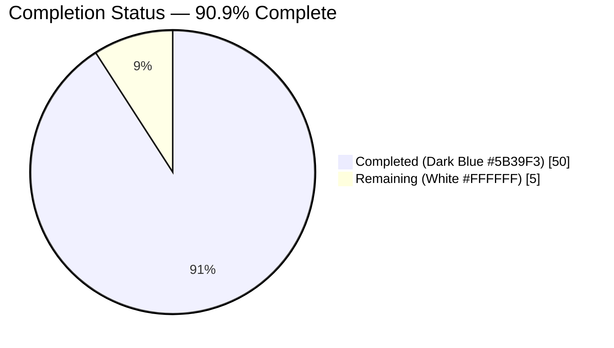
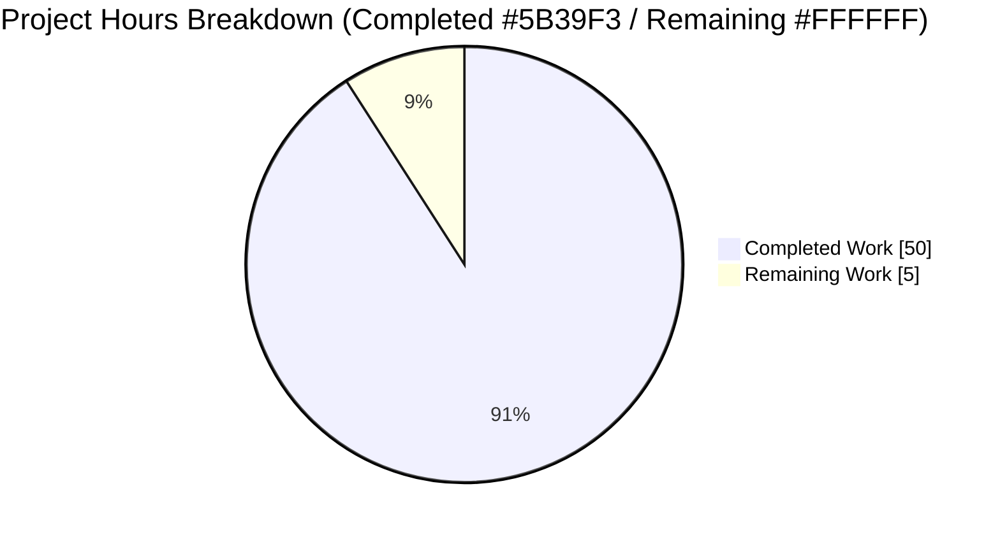
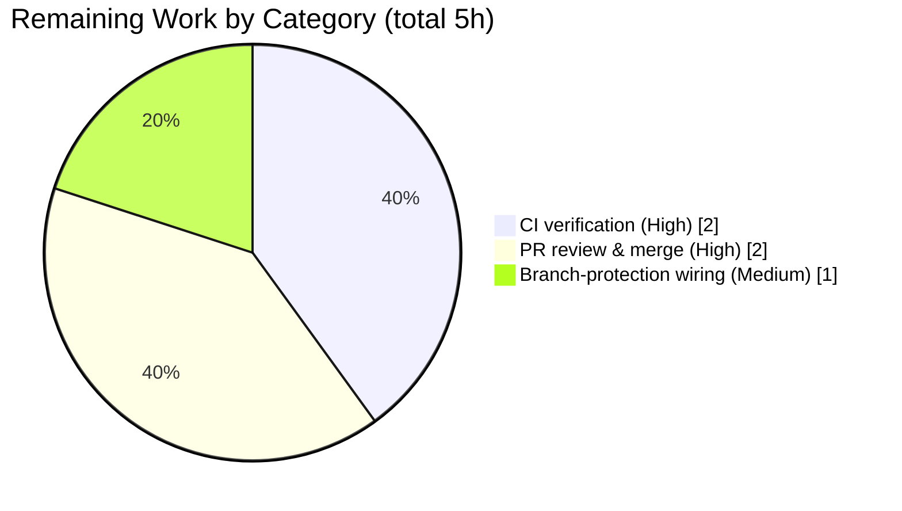

# Blitzy Project Guide — MAVLink In-Repo Test Suite

> **Brand color legend:** ⬤ **Completed / AI Work** = Dark Blue `#5B39F3` · ◯ **Remaining / Not Completed** = White `#FFFFFF` · Headings/Accents = Violet-Black `#B23AF2` · Highlight = Mint `#A8FDD9`

---

## 1. Executive Summary

### 1.1 Project Overview

MAVLink is a header-only C message-marshalling library whose C source is *generated* from XML message definitions by pinned Python tooling (`pymavlink`/`mavgen`). This project delivers the repository's **first in-repo automated test suite** — a minimal, self-contained suite that validates the definition → generation → runtime pipeline across three layers: static XML validation of all 19 dialects, a `common.xml` generate-and-compile integration test, and C pack/unpack round-trip tests (10 representative messages) plus one CRC-rejection test. A CI workflow runs the suite on every push and pull request. The target users are MAVLink maintainers and contributors, who gain automated regression protection where none previously existed. Scope was deliberately minimal-change: only test files, one workflow, and one guarded CMake edit.

### 1.2 Completion Status



**Completion = 50 / (50 + 5) = 90.9% complete** (PA1 AAP-scoped hours methodology).

| Metric | Hours |
|--------|-------|
| **Total Hours** | **55** |
| Completed Hours (AI + Manual) | 50 |
| Remaining Hours | 5 |
| **Percent Complete** | **90.9%** |

> All completed hours were delivered autonomously by Blitzy agents. The 5 remaining hours are **path-to-production only** (no code work): verify the first CI run, review/merge the PR, and wire the required status check.

### 1.3 Key Accomplishments

- ✅ **Objective 1 — XML definition validation:** parametrized `pytest` module validates all **19** dialect XMLs for well-formedness, unique message IDs, whitelisted field types, and 24-bit ID range (77 cases, all passing).
- ✅ **Objective 2 — Generation pipeline:** integration test generates `common.xml` C headers via the pinned submodule's `mavgen` and compiles them with `gcc -Wall`; transitive include chain (`common → standard → minimal`) resolves ("Found 206 message types in 3 XML files").
- ✅ **Objective 3 — C runtime correctness:** loopback round-trips for all **10** representative messages + bounded edge variants + one CRC-rejection test; **"ran 133 checks, 0 failures."**
- ✅ **Build wiring:** `tests/c/CMakeLists.txt`, `tests/CMakeLists.txt` forwarder, and a guarded `option(MAVLINK_BUILD_TESTS ... OFF)` + `add_subdirectory(tests)` in the root `CMakeLists.txt`.
- ✅ **CI workflow authored:** `.github/workflows/tests.yml` (push/PR, `ubuntu-latest`, 7 steps, YAML valid, locally validated).
- ✅ **Isolation & minimal-change fully honored:** exactly 9 files changed (+726 / −0); source tree never written to (`git status` clean after every run); `pymavlink` submodule pin unchanged.

### 1.4 Critical Unresolved Issues

| Issue | Impact | Owner | ETA |
|-------|--------|-------|-----|
| _None_ — no unresolved in-scope issues | All AAP objectives delivered; full suite passes locally with zero failures | — | — |

> There are **no critical unresolved issues**. The remaining work is standard path-to-production activity, not defect resolution.

### 1.5 Access Issues

| System/Resource | Type of Access | Issue Description | Resolution Status | Owner |
|-----------------|----------------|-------------------|-------------------|-------|
| GitHub Actions (repo CI) | Workflow execution | The authored `tests.yml` has not yet run on GitHub-hosted infrastructure (no push to origin observed in the authoring environment) | Pending first push/PR | Maintainer |
| Repository branch settings | Admin / branch protection | Adding the Tests job as a required status check requires repo admin permissions not available to the agent | Pending maintainer action | Maintainer |

> No blocking access issues for the delivered code. Both items above are ordinary maintainer/admin actions on the path to production.

### 1.6 Recommended Next Steps

1. **[High]** Push the branch and open the PR; monitor the **first GitHub Actions run** of `tests.yml` — confirm all 7 steps pass green on `ubuntu-latest` and the job completes under the 5-minute budget.
2. **[High]** Perform maintainer code review of the 9-file suite and **merge** the PR.
3. **[Medium]** Configure **branch protection** to make the "Tests / Python and C tests" job a required status check so it gates future PRs.
4. **[Low]** Forward the two documented out-of-scope items (root-CMake deprecation cleanup; generated-header packed-member warnings) to maintainers for separate consideration — **not** part of this scope.

---

## 2. Project Hours Breakdown

### 2.1 Completed Work Detail

| Component | Hours | Description |
|-----------|-------|-------------|
| Objective 1 — XML definition validation | 6 | `tests/python/test_xml_definitions.py` (93 lines): glob-parametrized over 19 dialects; 4 checks/dialect + discovery guard (77 cases). |
| Objective 2 — Generation + compile integration | 10 | `tests/python/test_generate_common.py` (52 lines) + `tests/python/conftest.py` (137 lines): session-scoped `mavgen` fixture, header-existence assertion, `gcc -Wall` compile with graceful skip when `gcc` absent. |
| Objective 3 — C round-trip + CRC | 14 | `tests/c/test_roundtrip.c` (306 lines): 10-message loopback via `mavlink_parse_char`, bounded edge variants (INT32/UINT32/FLT_MAX, 50-char STATUSTEXT), overflow-safe float comparator, one CRC-rejection test. |
| C build wiring | 6 | `tests/c/CMakeLists.txt` (44 lines, build-time header generation + rebuild dependency closure + CTest registration), `tests/CMakeLists.txt` forwarder (6 lines), guarded root `CMakeLists.txt` edit (+11 lines). |
| CI workflow authoring | 4 | `.github/workflows/tests.yml` (37 lines): push/PR, `ubuntu-latest`, submodule-recursive checkout, pip cache, pytest + CTest steps. |
| Documentation | 2 | `tests/README.md` (40 lines): prerequisites, run commands, CVE-mitigation note. |
| Validation, debugging & hardening | 8 | Fixes/hardening captured in commit history: assert-all-packed-fields + rebuild-dependency fix, float-edge overflow fix (P5-1), pytest CVE-2025-71176 mitigation (S7-1), source-tree isolation enforcement; plus full independent re-validation. |
| **Total Completed** | **50** | Matches Completed Hours in §1.2. |

### 2.2 Remaining Work Detail

| Category | Hours | Priority |
|----------|-------|----------|
| CI verification on GitHub Actions (confirm first real run is green, under 5-min budget) | 2 | High |
| PR review & merge (maintainer review of 9-file suite; merge to base) | 2 | High |
| Branch-protection wiring (add Tests job as required status check) | 1 | Medium |
| **Total Remaining** | **5** | Matches Remaining Hours in §1.2 and §7 pie chart. |

### 2.3 Hours Reconciliation

- Completed (§2.1) = **50h**
- Remaining (§2.2) = **5h**
- **§2.1 + §2.2 = 50 + 5 = 55h = Total Project Hours (§1.2)** ✓
- **Completion = 50 / 55 = 90.9%** ✓

---

## 3. Test Results

> **Integrity note:** every figure below originates from Blitzy's autonomous validation logs for this project and was **independently re-executed** during this assessment session (Python: `79 passed in 0.70s`; C: `ctest` 1/1, direct run "ran 133 checks, 0 failures").

| Test Category | Framework | Total Tests | Passed | Failed | Coverage % | Notes |
|---------------|-----------|-------------|--------|--------|------------|-------|
| Unit — XML definition validation | pytest 7.4.4 | 77 | 77 | 0 | n/a (no gate) | 1 discovery guard + 4 checks × 19 dialects; well-formedness, unique IDs, field-type whitelist, 24-bit ID range. |
| Integration — generation + compile | pytest 7.4.4 | 2 | 2 | 0 | n/a | Headers-exist + `gcc -Wall` compile of a probe including `common/mavlink.h`; both ran (gcc present). |
| Runtime — C round-trip + CRC | CTest / plain C | 1 CTest case (133 internal checks) | 1 (133) | 0 (0) | n/a | 11 functions = 10 message round-trips + 1 CRC-rejection; direct run: **"ran 133 checks, 0 failures."** |
| **Totals** | pytest + CTest | **79 pytest + 1 CTest** | **all** | **0** | — | Full suite ≈ 9s locally; no coverage tooling by design (no numeric gate in AAP). |

**Representative messages covered (Objective 3):** HEARTBEAT, SYS_STATUS, PARAM_VALUE, GPS_RAW_INT, ATTITUDE (with `time_boot_ms` = 0 / `UINT32_MAX` and `roll` = ±`FLT_MAX` edges), RC_CHANNELS, MISSION_ITEM_INT, COMMAND_LONG (±`FLT_MAX` edges), STATUSTEXT (50-char), GLOBAL_POSITION_INT (proves `standard.xml` transitive include).

---

## 4. Runtime Validation & UI Verification

This is a headless test-suite deliverable — there is no application UI. "Runtime" here means the executable test artifacts and documented run sequences. All were executed end-to-end this session from a clean tree.

- ✅ **Operational** — `python -m pytest tests/python -v` → **79 passed** in ~0.70s.
- ✅ **Operational** — CI-form `PYTEST_DEBUG_TEMPROOT="$(mktemp -d)" python -m pytest tests/python -v` → 79 passed.
- ✅ **Operational** — `-k` filter example `... test_xml_definitions.py -k common -v` → 4 passed / 73 deselected.
- ✅ **Operational** — `cmake -S . -B build -DMAVLINK_BUILD_TESTS=ON` → exit 0.
- ✅ **Operational** — `cmake --build build` → exit 0.
- ✅ **Operational** — `ctest --test-dir build --output-on-failure` → **1/1 c_roundtrip PASSED**.
- ✅ **Operational** — direct executable run → **"ran 133 checks, 0 failures."**
- ✅ **Operational** — `mavgen` transitive include resolution → "Found 206 message types in 3 XML files" (`common → standard → minimal`).
- ✅ **Operational** — source-tree isolation: `git status --porcelain` empty after every Python and C run, and after build-dir cleanup.
- ⚠ **Partial** — real **GitHub Actions** execution of `tests.yml` not yet performed (authored + locally validated; awaits first push — see §1.5, §6/I1).
- **UI Verification:** ❌ Not applicable — no user interface in scope.

---

## 5. Compliance & Quality Review

Cross-mapping of AAP deliverables and mandated constraints to observed evidence, including fixes applied during autonomous validation.

| AAP Deliverable / Constraint | Benchmark | Status | Evidence / Notes |
|------------------------------|-----------|--------|------------------|
| Objective 1 — XML validation (19 dialects) | Assertion-based, parametrized | ✅ Pass (100%) | 77 pytest cases pass; glob-parametrized, not hardcoded; discovery guard present. |
| Objective 2 — generate + compile `common.xml` | Real `mavgen` + `gcc -Wall` | ✅ Pass (100%) | Headers generated to temp dir; probe compiles; transitive includes resolve. |
| Objective 3 — 10-message round-trip + CRC | Loopback via `mavlink_parse_char` | ✅ Pass (100%) | 133 checks, 0 failures; CRC test flips a CRC byte and asserts frame never `MAVLINK_FRAMING_OK`. |
| Minimal-change / fixed change set | Only tests/ + 1 workflow + 1 guarded CMake edit | ✅ Pass | Exactly 9 files changed (8 CREATE + 1 UPDATE); +726 / −0. |
| No production refactoring | Generated C / XML / modules untouched | ✅ Pass | No edits outside the permitted set; generated API exercised as-is. |
| `pymavlink` submodule pin unchanged | Pin `aa033552` (`v2.4.49-3-gaa033552`) | ✅ Pass | Submodule clean at pin; not updated/patched. |
| Isolation (source tree never written) | `git status` clean after runs | ✅ Pass | Verified after every run; `conftest` redirects pytest cache/temp; `build/` git-ignored. |
| No mocking / no network / no GUI | Real XML read-only; in-memory C buffers | ✅ Pass | No mock/stub libraries anywhere. |
| Least-code selection | stdlib `xml.etree`; plain C + CTest | ✅ Pass | Only genuinely new dependency is `pytest`. |
| CI toolchain versions | `pytest` 7.4.4 (honors `pymavlink` `<=7.4.4`) | ✅ Pass | Version pin validated against submodule constraint. |
| Float-edge comparator correctness | No overflow / non-finite acceptance | ✅ Pass (fix applied) | Overflow-safe double comparator (commit `e84613ad`, P5-1). |
| C-test rebuild dependency closure | Regenerate on XML change | ✅ Pass (fix applied) | `DEPENDS` on `common/standard/minimal.xml` (commit `7f5ec220`). |
| pytest CVE-2025-71176 (CWE-379) | Avoid predictable `/tmp` temp base | ✅ Mitigated | Private `mktemp -d` `PYTEST_DEBUG_TEMPROOT` (conftest setdefault + CI explicit); documented. |
| CI runtime budget | < 5 minutes | ⚠ Pending real-run confirmation | Local full suite ≈ 9s; pip cache enabled; single-dialect generation. |
| Defect handling (documented, not fixed) | Note out-of-scope issues only | ✅ Pass | Packed-member warnings + pre-existing root-CMake deprecation documented, not fixed. |

**Outstanding compliance items:** only the real-CI confirmation of the sub-5-minute budget (⚠), addressed by the High-priority CI-verification task.

---

## 6. Risk Assessment

Overall risk profile is **LOW**: the suite is fully implemented, locally validated, and free of in-scope defects. No High or Critical risks exist.

| Risk | Category | Severity | Probability | Mitigation | Status |
|------|----------|----------|-------------|------------|--------|
| T1 — CI runner toolchain drift (`ubuntu-latest` gcc ~13 / cmake vs local gcc 15.2.0) | Technical | Low | Low | No `-Werror`; integration test asserts only `gcc` returncode == 0; CTest only needs the executable to pass. | Open (verify first CI run) |
| T2 — `-Waddress-of-packed-member` (24) from generated headers under `-Wall` | Technical | Low | High | By design (packed wire-format structs); out-of-scope generated code; documented, not fixed per AAP 0.1.2. | Accepted (by design) |
| S1 — pytest 7.4.4 CVE-2025-71176 / GHSA-6w46-j5rx-g56g (CWE-379, predictable `/tmp` temp base) | Security | Medium | Low | Mitigated via private `mktemp -d` `PYTEST_DEBUG_TEMPROOT` (conftest + CI); pin required by `pymavlink` `pytest <= 7.4.4`. | Mitigated |
| S2 — Unpinned `lxml` / `future` test deps (supply-chain surface) | Security | Low | Low | Test/generator-only, never shipped (library is header-only); mirrors existing CI `pip install future lxml`. | Accepted |
| O1 — CI < 5-min budget unverified on real runner | Operational | Low | Low | Local full suite ≈ 9s; pip cache enabled; single-dialect generation only. | Open (verify in CI) |
| O2 — No branch protection yet (Tests not a required check) | Operational | Low | Medium | Configure required status check post-merge (task P3). | Open (path-to-prod) |
| I1 — First-ever CI execution on GitHub Actions | Integration | Low | Medium | `tests.yml` mirrors proven `test_and_deploy.yml` conventions (submodule-recursive checkout, `pip install future lxml`); monitor first run. | Open — most material unknown |
| I2 — Submodule not initialized on fresh checkout (`mavgen` needs pinned `pymavlink`) | Integration | Low | Low | Workflow uses `submodules: recursive`; README documents `git submodule update --init --recursive`. | Mitigated |

**Out-of-scope items (documented, not fixed per AAP — maintainer handoff, not risks):** (1) generated-header packed-member warnings; (2) pre-existing root `CMakeLists.txt` `cmake_minimum_required(2.8.2)` deprecation + dead `if(BUILD_TEST)` block.

---

## 7. Visual Project Status



> **Integrity:** "Remaining Work" = **5h**, identical to §1.2 Remaining Hours and the §2.2 Hours total. "Completed Work" = **50h** = §2.1 total.

**Remaining hours by category (from §2.2):**



**Priority distribution of remaining work:** High = 4h (80%) · Medium = 1h (20%) · Low = 0h.

---

## 8. Summary & Recommendations

**Achievements.** The project delivers MAVLink's first in-repo automated test suite exactly to the AAP's tightly-scoped mandate. All three objectives are complete and independently re-validated: 19-dialect XML validation (77 pytest cases), `common.xml` generate-and-compile integration, and C round-trip + CRC runtime coverage (133 checks, 0 failures). The change set is precisely the 9 permitted files (+726 / −0), the `pymavlink` pin is untouched, and source-tree isolation is verified after every run.

**Remaining gaps.** The **5 remaining hours are entirely path-to-production** — no code work: (1) confirm the first GitHub Actions run is green within the 5-minute budget, (2) review and merge the PR, and (3) add the Tests job as a required status check.

**Critical path to production.** Push → observe first CI run → review → merge → enable required check. The single most material unknown is the first real CI execution (risk I1), mitigated by mirroring the repository's proven `test_and_deploy.yml` conventions.

**Production readiness.** The delivered code is **production-ready** for its objective. Overall risk is **LOW** with no High/Critical risks and zero unresolved in-scope errors; the one Medium-severity item (pytest CVE) is already mitigated.

**Success metrics.** ✅ 19/19 dialects validated · ✅ `common.xml` compiles under `gcc -Wall` · ✅ 10/10 messages round-trip + CRC rejection · ✅ suite ≈ 9s (< 5-min budget) · ✅ source tree remains git-clean.

**The project is 90.9% complete (50 of 55 hours).** Reaching 100% requires only the three human path-to-production tasks in §2.2.

| Metric | Value |
|--------|-------|
| Completion | 90.9% (50 / 55h) |
| In-scope defects | 0 |
| Tests passing | 79 pytest + 133 C checks (100%) |
| Files changed | 9 (8 new, 1 edited), +726 / −0 |
| Overall risk | Low |

---

## 9. Development Guide

All commands below were executed successfully during this assessment from the repository root and are copy-pasteable.

### 9.1 System Prerequisites

- **OS:** Linux (CI uses `ubuntu-latest`; validated locally on Ubuntu 25.10).
- **Python:** 3.11 (validated on 3.11.15).
- **C toolchain:** `gcc`, `cmake` (≥ 3.x), `ctest` (validated: gcc 15.2.0, cmake/ctest 3.31.6).
- **Git:** with submodule support (validated: git 2.51.0).

### 9.2 Environment Setup

```bash
# From the repository root
# 1) Initialize the pinned pymavlink submodule (required by mavgen)
git submodule update --init --recursive

# 2) Create and activate a Python 3.11 virtual environment
python3.11 -m venv .venv
source .venv/bin/activate
```

> **Isolation & CVE note:** the suite runs pytest under a private temp root to mitigate CVE-2025-71176. `conftest.py` sets `PYTEST_DEBUG_TEMPROOT` automatically when unset; CI sets it explicitly. No action needed for local runs.

### 9.3 Dependency Installation

```bash
python -m pip install --upgrade pip
pip install pytest==7.4.4 future lxml
```

> `pytest` is pinned to **7.4.4** to honor the `pymavlink` submodule's `pytest <= 7.4.4` constraint. `future` and `lxml` are generator dependencies (mirroring existing CI); the test code itself imports only the standard library plus `pytest`.

### 9.4 Test Startup Sequence

```bash
# Python suite (XML validation + generation/compile integration)
python -m pytest tests/python -v

# C suite (configure → build → run)
cmake -S . -B build -DMAVLINK_BUILD_TESTS=ON
cmake --build build
ctest --test-dir build --output-on-failure
```

### 9.5 Verification Steps

- **Python:** expect `============ 79 passed in ~0.7s ============`.
- **CTest:** expect `100% tests passed, 0 tests failed out of 1` (`c_roundtrip`).
- **Direct C executable (optional):** `./build/tests/c/test_roundtrip` prints **`ran 133 checks, 0 failures`** (exit 0).
- **Isolation:** `git status --porcelain` returns nothing after runs (source tree unmodified).

### 9.6 Example Usage

```bash
# Run only common.xml validation cases (filter by -k)
python -m pytest tests/python/test_xml_definitions.py -k common -v
# -> 4 passed, 73 deselected

# CI-equivalent Python invocation (private temp root)
PYTEST_DEBUG_TEMPROOT="$(mktemp -d)" python -m pytest tests/python -v
```

### 9.7 Troubleshooting

- **`ModuleNotFoundError: pymavlink` / mavgen import error** → submodule not initialized. Run `git submodule update --init --recursive`.
- **`gcc` not found** → the `test_generate_common.py` compile test auto-skips (via `shutil.which("gcc")`); install `gcc` to exercise it. It will not hard-fail.
- **`-Waddress-of-packed-member` warnings during `cmake --build`** → expected and benign; they originate from out-of-scope generated headers (packed wire-format structs). There is no `-Werror`; the integration test asserts only `gcc` returncode == 0.
- **C tests don't build** → ensure `-DMAVLINK_BUILD_TESTS=ON` is passed; the option defaults to `OFF` so default builds/installs are unaffected.
- **Stray `__pycache__`/`.pyc` or non-clean tree** → the suite disables bytecode writing and redirects the pytest cache; re-run and confirm `git status --porcelain` is empty.

---

## 10. Appendices

### A. Command Reference

| Purpose | Command |
|---------|---------|
| Init submodule | `git submodule update --init --recursive` |
| Create venv | `python3.11 -m venv .venv && source .venv/bin/activate` |
| Install deps | `pip install pytest==7.4.4 future lxml` |
| Run Python tests | `python -m pytest tests/python -v` |
| Run Python (CI form) | `PYTEST_DEBUG_TEMPROOT="$(mktemp -d)" python -m pytest tests/python -v` |
| Filter Python tests | `python -m pytest tests/python/test_xml_definitions.py -k common -v` |
| Configure C tests | `cmake -S . -B build -DMAVLINK_BUILD_TESTS=ON` |
| Build C tests | `cmake --build build` |
| Run C tests | `ctest --test-dir build --output-on-failure` |
| Run C exe directly | `./build/tests/c/test_roundtrip` |
| Verify isolation | `git status --porcelain` |

### B. Port Reference

Not applicable — the deliverable is a headless test suite with no network services or listening ports.

### C. Key File Locations

| File | Lines | Mode | Role |
|------|-------|------|------|
| `tests/python/test_xml_definitions.py` | 93 | CREATE | 19-dialect XML validation (Objective 1) |
| `tests/python/test_generate_common.py` | 52 | CREATE | Generate + `gcc -Wall` compile (Objective 2) |
| `tests/python/conftest.py` | 137 | CREATE | Session-scoped `mavgen` fixture; isolation + CVE mitigation |
| `tests/c/test_roundtrip.c` | 306 | CREATE | 10-message round-trip + CRC rejection (Objective 3) |
| `tests/c/CMakeLists.txt` | 44 | CREATE | Build-time header gen + CTest registration |
| `tests/CMakeLists.txt` | 6 | CREATE | Forwarder (`add_subdirectory(c)`) |
| `tests/README.md` | 40 | CREATE | Local-run documentation |
| `.github/workflows/tests.yml` | 37 | CREATE | CI (push/PR, ubuntu-latest) |
| `CMakeLists.txt` (root) | +11 | UPDATE | `option(MAVLINK_BUILD_TESTS OFF)` + guarded `add_subdirectory(tests)` |

### D. Technology Versions

| Component | Version | Notes |
|-----------|---------|-------|
| Python | 3.11.15 | CI targets 3.11 |
| pytest | 7.4.4 | Honors `pymavlink` `pytest <= 7.4.4` |
| lxml | 6.1.1 (local) / `>=3.6.0` | Generator dependency (mirrors CI) |
| future | 1.0.0 (local) | Generator compat shim |
| gcc | 15.2.0 (local) / ~13.x (CI) | No compiler matrix; GCC only |
| cmake / ctest | 3.31.6 (local) / ≥3.x (CI) | Build/test driver |
| git | 2.51.0 | With submodule support |
| pymavlink (submodule) | `aa033552` (`v2.4.49-3-gaa033552`) | Pin unchanged |

### E. Environment Variable Reference

| Variable | Purpose | Set by |
|----------|---------|--------|
| `PYTEST_DEBUG_TEMPROOT` | Private, unpredictable pytest temp base (CVE-2025-71176 / CWE-379 mitigation) | `conftest.py` (auto, when unset) and CI (explicit `mktemp -d`) |
| `MAVLINK_BUILD_TESTS` | CMake option gating the C test build (default `OFF`) | `-DMAVLINK_BUILD_TESTS=ON` at configure time |
| `PYTHONPATH` | Set to repo root inside the fixture so pinned submodule `mavgen` is used | `conftest.py` fixture |
| `PYTHONDONTWRITEBYTECODE` | Prevents `.pyc` writes during generation (isolation) | `conftest.py` |

### F. Developer Tools Guide

- **pytest** — Python test runner. Use `-v` for verbose, `-k <expr>` to filter cases.
- **CMake + CTest** — C build/test driver. `-DMAVLINK_BUILD_TESTS=ON` enables the C suite; `ctest --output-on-failure` surfaces failing check output.
- **mavgen** (`python -m pymavlink.tools.mavgen`) — generates C headers from XML; invoked by the fixture with `--lang=C --wire-protocol=2.0`.
- **git submodule** — `--init --recursive` is mandatory before generation (provides pinned `pymavlink`).

### G. Glossary

| Term | Definition |
|------|------------|
| Dialect | An XML message-definition file under `message_definitions/v1.0/` (19 total). |
| `mavgen` | The `pymavlink` code generator that emits C headers from dialect XML. |
| Round-trip (loopback) | Pack a message → serialize to bytes → feed through `mavlink_parse_char` → decode → assert field equality. |
| CRC rejection | Corrupting a CRC byte and asserting the parser never reports `MAVLINK_FRAMING_OK`. |
| Transitive include | `common.xml` includes `standard.xml`, which includes `minimal.xml`; generating `common` resolves all three. |
| Path-to-production | Non-code activities (CI run, review/merge, branch protection) required to deploy the deliverable. |
| Header-only | The MAVLink C library ships entirely as headers with no external runtime dependencies. |

---

*Completion is measured strictly against AAP-scoped and path-to-production work (PA1 methodology): **50h completed / 5h remaining / 55h total = 90.9%**. Completed = Dark Blue `#5B39F3`; Remaining = White `#FFFFFF`.*